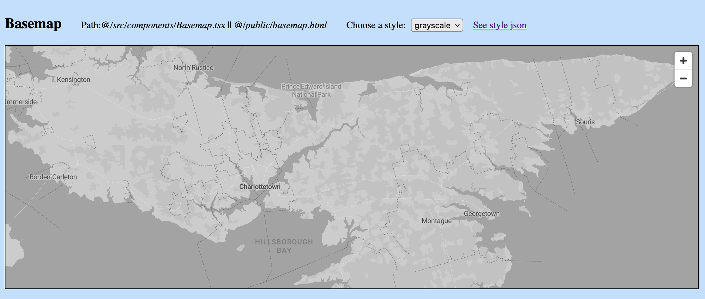
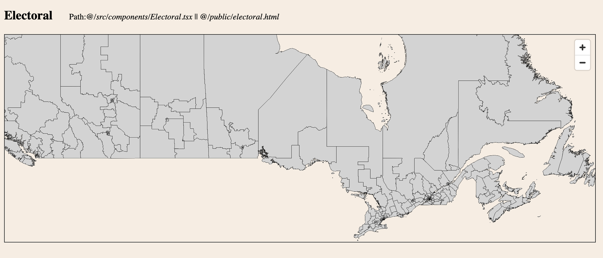

# Web Maps: Open-source & Serverless

Here is a summary of how to build web maps with open-source resources and statically serve its data. The next paragraph mentions why it is a practical solution and gives the names of the main technologies used in the examples for already bored readers. The rest of the article will outline how to create assets and implement two simple instances with a base map and extra data.

Maps deal with intricate data and are supposed to provide high flexibility to allow numerous kinds of interactions. In addition to geographic data, maps also utilize assets such as glyphs and sprites (which can be translated as fonts and icons for non-nerds). Geographic data from OpenStreetMap (OSM) and glyphs generated with MapLibre’s Font Maker are enough to build a simple base map. To lazy load the data for better performance, map data is usually hosted as tilesets: Depending on the zoom level, only the data for the visible map area is requested from the servers. Thanks to the pmtiles protocol of Protomaps, we can serve the data as a single file and request it partially in the front end (http 206). As map data is highly complicated, managing map styles might need a visual editor of which Maputnik is a great example. Finally, we have some good alternatives to implement the map in the front end such as MapLibre and Leaflet. These open-source tools allow us to easily modify the map styles and build a map without setting up a server.

Sample assets and React-TypeScript codes can be found in this repo. The /public folder also has vanilla JavaScript versions for those who are in their 3rd week of speedy web development bootcamp.

## Base maps

Base maps are reference maps providing the geographical context on which extra data can be overlayed. A base map can include layers of water, earth, buildings, roads, boundaries, and so on. On top of the base map, additional spatial data can be displayed as layers which usually consist of symbols, labels, and borders. In the first example, we are gonna build a sole base map with different styles. To specify the base map for the frontend libraries, we need only one JSON file called Map Style. For a simple demo, we’ll focus on three main pieces of a map-style file: sources, glyphs, and layers. (See `/public/styles` folder for style samples.)



### STEP 1: Prepare Base Map Source

There are several sources to download OpenStreetMap geographic data such as Geofabrik and Planet OSM. The file size for the whole planet is ~130 GB, so regional data might be preferable for smaller maps. Once the data is downloaded, we'll convert it to the pmtiles format. PMTiles is a single-file format that allows reading the data as tiles for vector maps. Also, [protomaps/basemaps](https://github.com/protomaps/basemaps) can be used to directly generate pmtiles with OSM data.

The `/public/data` folder has shapefile and pmtiles data files for Prince Edward Island in Canada, chosen for its cuteness and small file size. For a real-life scenario, this big data file would be hosted in the cloud and we wouldn’t serve it in repo. Mapshaper is a greatly useful tool to inspect, convert, and simplify most of the map data formats. Pmtiles files can be inspected with PMTiles Viewer.

Any source can be added to the style file as follows. Source ID (protomaps) can be modified and should match the ID references in layers. The URL should have the prefix “pmtiles://“. The URL in this example is the relative path aiming at the public folder.

```json
"sources": {
    "protomaps": {
      "type": "vector",
      "url": "pmtiles://data/pmtiles/prince-edward-island.pmtiles"
    }
},
```

### STEP 2: Prepare Base Map Glyphs

The layers in style files specify the fonts used in maps. The texts are also rendered based on zoom levels and the glyph sets in PBF format are requested as needed. We need to serve all requested font stacks for all ranges. The font choices can be changed in layers and the glyph sets for any font can be easily generated with MapLibre’s Font Maker.

The `/public/glyphs` folder has the glyph sets for the three fonts used in the sample styles. The glyphs can be added to the style file as follows. This example is the relative path aiming at the public folder.

```json
"glyphs": "/glyphs/{fontstack}/{range}.pbf"
```

### STEP 3: Prepare Base Map Style

The style file defines the appearance of the base map: where to get data and assets such as glyphs and sprites, and how to style data. Data consists of layers. The style file can have filtering and painting rules by specifying or grouping layers. Also, we need to confirm that our data and styles are compatible.

Again, the JSON file for map style is the only necessary file to specify the base map in the front end implementation. The `/public/styles` folder has 6 sample style files, including layers generated with `protomaps/basemaps` for OSM data. These styles refer to the data and glyphs included in the repo with relative paths. See MapLibre Style Spec to learn more about style files.

### STEP 4: Implement Frontend

It’s enough to use `<Map/>` component from `react-map-gl/maplibre` (with initial settings such as zoom level and map center) and refer to the style file to build a base map. Don't forget to add the pmtiles protocol. The demo has a select component to test it with 6 styles. The codes are at `/src/components/Basemap.tsx` and `/public/basemap.html`.

```js
// Add Protocol
useEffect(() => {
    const protocol = new Protocol();
    maplibregl.addProtocol('pmtiles', protocol.tile);
    return () => maplibregl.removeProtocol('pmtiles');
}, []);

// Setup Basemap
return (
    <Map
      initialViewState={{
        longitude: -63.1872,
        latitude: 46.4974,
        zoom: 7.25,
      }}
      minZoom={7.25}
      maxZoom={12}
      ...
      mapStyle='/styles/grayscale.json'
    />
);
```

## Extra Sources: Electoral Districts Example

Extra data sources (for symbols, areas, etc.) can be displayed with or without base maps. The layers sit on top of base maps and allow interactions and custom stylings.



For the second example, I downloaded Canada’s Federal electoral districts from Statistics Canada (Cartographic Boundary Files in Shapefile format) and converted it to pmtiles using the command line tools as below. The output file (electoralCanada.pmtiles, 60 MB) is also included in `/data/pmtiles`.

```
ogr2ogr -f GeoJSON geojson.geojson lfed000b21a_e.shp -t_srs EPSG:4326
tippecanoe -o electoralCanada.pmtiles geojson.geojson -zg -s EPSG:4326
```

Usually, the data for extra layers doesn’t need to have a big file size. For example, the electoral map in this demo is unnecessarily detailed for an election page. You can simplify the downloaded Shapefile from StatCan on MapShaper, reduce it even to its 1% and it would be detailed enough for a real-life scenario with less than 2 MB file size. You might prefer to serve the small data files (geojson, topojson, etc.) in the repo and load it at once. For demo purposes, I didn’t simplify it to show that we can use large pmtiles as extra sources, too.

When the data file is ready to use, we can implement the map in the front end by specifying the file path and painting rules. You can inspect the names of source layers on MapShaper or PMTiles Viewer.

```js
return (
  <Map
    initialViewState={{
      longitude: -94.35,
      latitude: 63,
      zoom: 2.5,
    }}
    // {...}
  >
    <Source
      id="electoralCanada"
      type="vector"
      url="pmtiles://data/pmtiles/electoralCanada.pmtiles"
    >
      <Layer
        type="fill"
        source="electoralCanada"
        source-layer="geojson"
        paint={{
          'fill-color': 'lightgray',
          'fill-outline-color': 'black',
        }}
      />
    </Source>
  </Map>
);
```

In this demo, two maps are implemented with open-source tools and a server-less setup. All the assets are hosted in repo and no server is needed for vector maps.
